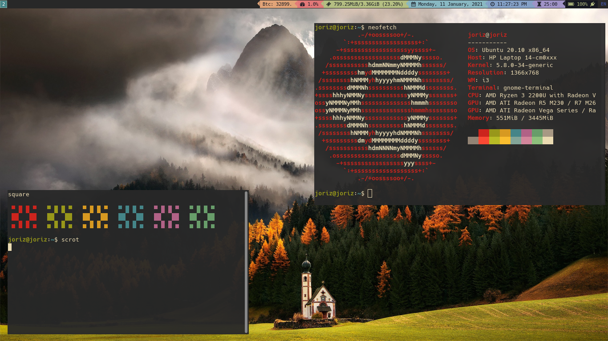

# Dotfiles

Dotfiles
This repository contains configuration files for various tools and applications that I use on my personal computer. These configuration files, also known as "dotfiles," are named with a leading . and are stored in the home directory (~/) of the user.

## Contents
* `.bashrc`: configuration file for the Bash shell, which is the default shell on most Linux systems.
* `.vimrc`: configuration file for the Vim text editor.
### `.config` Folder
* `i3`: configuration files for the i3 window manager, which is a tiling window manager for Linux.
* `neofetch`: configuration file for the Neofetch system information tool.
* `rofi`: configuration file for the Rofi application launcher and window switcher.

## Usage

To use these dotfiles on your own system, simply clone this repository and move the configuration files to the appropriate locations in your home directory. For example, to use the `.bashrc` file, copy it to `~/.bashrc`.

Keep in mind that these configuration files may contain personalization and customization specific to my own setup and preferences. You may want to review and modify the files to suit your own needs before using them.